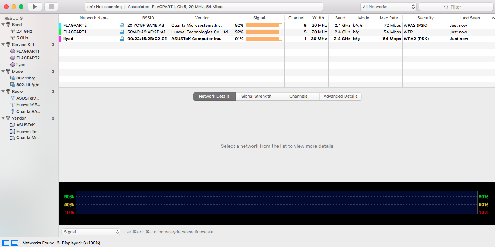

# F1r3d&H4ck3d - Egypt

So we got a Folder with a bunch of files inside.
Some Word Documents, PCAP files and other stuff.

We noticed this suspicios Screenshot in the Folder:

There were 2 Hotspots:

FLAGPART1: 5C:4C:A9:AE:2D:A1

FLAGPART2: 20:7C:8F:9A:1E:A3

So the Idea was, that the flagname is the combination of the Networkpasswords.

There were 2 Network Types: WEP and WPA2 PSK

####The PCAP Files
So the first thing we needed was to get all the pcap files in the folders.
So after we put them all together in one folder.
The first thing was, that we needed to convert the PCAPng files PCAP files via editcap:
`editcap <infile> <outfile>`

After this they were usable with aircrack-ng

##### WEP

WEP is easily crackable with captured IV. We had enough captured traffic to crack them via aircrack-ng.
But there were not enough in a single PCAP File. You need minimum of 5000 IVs to crack it.
Therefore we combined all the PCAP files with the following tool which is integrated of aircrack: '`mergecap` (check manpage for usage)

After we merged the files we had enough data to crack the password easily with the following command:

`aircrack-ng -b BSSID <merged PCAP File>`

##### WPA2/PSK

In the captured traffic was also a between a Client and the FLAGPART2 Network.
It is possible to bruteforce the password of a WPA2/PSK Network if you have a handshake captured.

We tried the password.lst in the test folder, and the rockyou wordlist with Hashcat to crack the password, but it wasn't there.
Then cluosh found a link to a password list in one of the word documents.
This was the key for the solution. The used password was in the passwordlist. And we cracked the password via [hashcat](https://hashcat.net/hashcat/)

 
#####The Flag
The Flag was the combination of the Passwords from FLAGPART1 and FLAGPART2 Networks.

